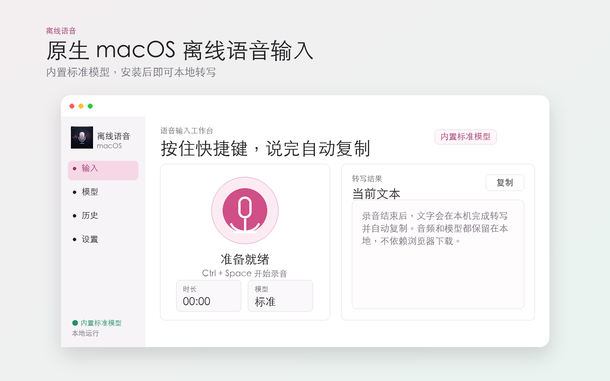
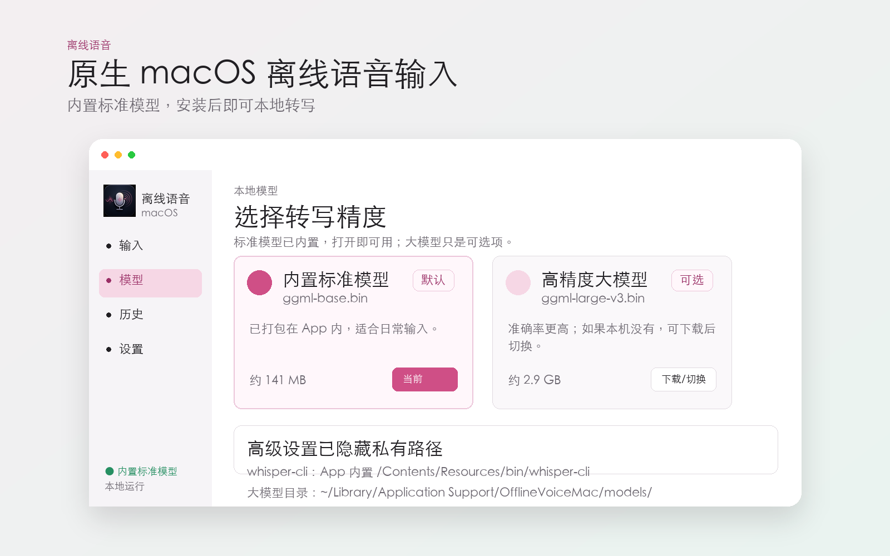
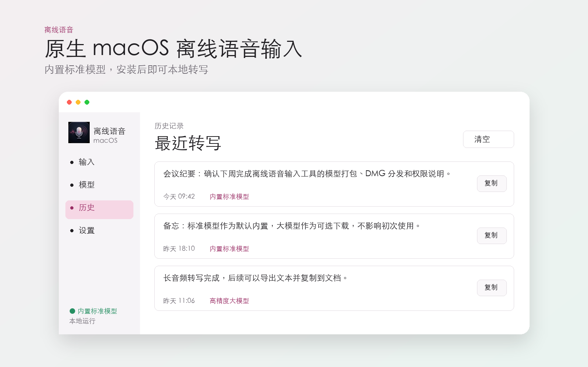
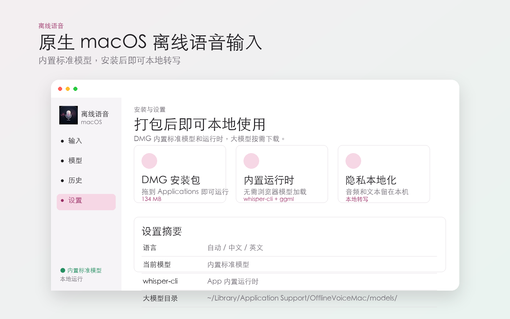

# OfflineVoiceMac

OfflineVoiceMac 是一个原生 macOS 离线语音输入工具。它录制麦克风音频后在本机调用 `whisper.cpp` 的 `whisper-cli` 转写，不依赖浏览器端模型加载。

## 功能

- 原生 SwiftUI macOS 应用
- 本地录音、本地转写、本地历史记录
- DMG 打包时可内置 `ggml-base.bin` 作为默认模型
- 可切换本机已有的 `ggml-large-v3.bin`
- 可在应用内下载大模型到 `~/Library/Application Support/OfflineVoiceMac/models/`
- 支持自动复制、保留录音、语言选择和高级路径配置

## 展示图









## 准备依赖

```bash
brew install whisper-cpp
```

构建脚本默认从下面的位置寻找内置标准模型：

```text
$HOME/whisper.cpp/models/ggml-base.bin
```

也可以显式指定：

```bash
OFFLINE_VOICE_BASE_MODEL=/path/to/ggml-base.bin ./script/build_and_run.sh --build-only
```

可选大模型默认会自动检测：

```text
$HOME/whisper.cpp/models/ggml-large-v3.bin
~/Library/Application Support/OfflineVoiceMac/models/ggml-large-v3.bin
```

## 本地运行

```bash
./script/build_and_run.sh
```

只构建 `.app`：

```bash
./script/build_and_run.sh --build-only
```

## 打包 DMG

```bash
./script/package_dmg.sh
```

输出文件：

```text
dist/OfflineVoiceMac.dmg
```

DMG 内的 `.app` 会尽量包含：

- `Contents/Resources/models/ggml-base.bin`
- `Contents/Resources/bin/whisper-cli`
- `Contents/Resources/lib/*.dylib`
- `Contents/Resources/libexec/*.so`
- `Contents/Resources/AppIcon.icns`

当前脚本使用 ad-hoc 签名，适合本地测试和手动分发。公开分发需要 Developer ID 签名和 notarization。

## 下载模型

```bash
./script/download_model.sh ggml-base.bin
./script/download_model.sh ggml-large-v3.bin
```

下载后的模型会放在项目本地 `models/` 目录。该目录默认不会提交到 Git。

## 许可证

MIT
